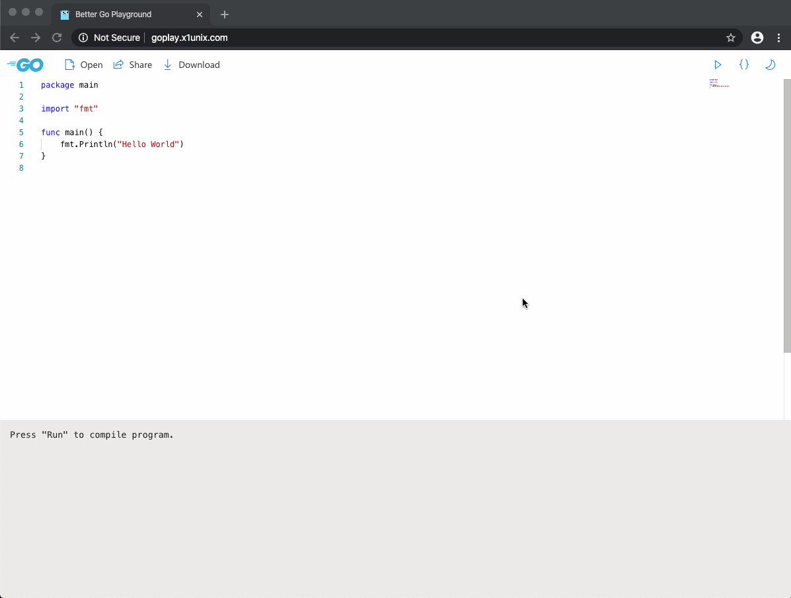

[](https://github.com/vshymanskyy/StandWithUkraine/blob/main/docs/README.md)

# Better Go Playground

[](https://hub.docker.com/r/x1unix/go-playground)
[](https://hub.docker.com/r/x1unix/go-playground)
[](https://travis-ci.org/x1unix/go-playground) 
[](https://coveralls.io/github/x1unix/go-playground?branch=dev)
[](https://goreportcard.com/report/github.com/x1unix/go-playground)

Improved Go Playground powered by Monaco Editor and React - [https://goplay.tools/](https://goplay.tools)



## Features

* 🌚 Dark theme
* 💡 Code autocomplete
* 💾 Load and save files
* 📔 Snippets and tutorials
* ⚙ Customization (fonts, ligatures, etc)
* 🛠 [WebAssembly](https://github.com/golang/go/wiki/WebAssembly) support


And more !

## Installation

### Docker

Playground is available as Docker image in [Docker Hub](https://hub.docker.com/r/x1unix/go-playground) and [GitHub Container Registry](https://github.com/x1unix/go-playground/pkgs/container/go-playground%2Fgo-playground).

See [wiki](https://github.com/x1unix/go-playground/wiki/Docker) for usage info.

### Local instance

Service can be built and run locally (**Go 1.17+** and **Node.js** required):

```bash
git clone https://github.com/x1unix/go-playground.git
cd go-playground
make
sudo make install
```

### Third-party credits

* Default playground run server provided by [play.golang.org](https://play.golang.org)
* Code for templates and tutorials provided by [gobyexample.com](https://gobyexample.com/)
* Code completion snippets were inspired by [tj/vscode-snippets](https://github.com/tj/vscode-snippets/blob/master/go.json)


## Contributors

### Code Contributors

This project exists thanks to all the people who contribute. [[Contribute](CONTRIBUTING.md)].
<a href="https://github.com/x1unix/go-playground/graphs/contributors"></a>

### Financial Contributors

Become a financial contributor and help us sustain our community. [[Contribute](https://opencollective.com/bttr-go-playground/contribute)]

#### Individuals

<a href="https://opencollective.com/bttr-go-playground"></a>

#### Organizations

Support this project with your organization. Your logo will show up here with a link to your website. [[Contribute](https://opencollective.com/bttr-go-playground/contribute)]

<a href="https://opencollective.com/bttr-go-playground/organization/0/website"></a>
<a href="https://opencollective.com/bttr-go-playground/organization/1/website"></a>
<a href="https://opencollective.com/bttr-go-playground/organization/2/website"></a>
<a href="https://opencollective.com/bttr-go-playground/organization/3/website"></a>
<a href="https://opencollective.com/bttr-go-playground/organization/4/website"></a>
<a href="https://opencollective.com/bttr-go-playground/organization/5/website"></a>
<a href="https://opencollective.com/bttr-go-playground/organization/6/website"></a>
<a href="https://opencollective.com/bttr-go-playground/organization/7/website"></a>
<a href="https://opencollective.com/bttr-go-playground/organization/8/website"></a>
<a href="https://opencollective.com/bttr-go-playground/organization/9/website"></a>
